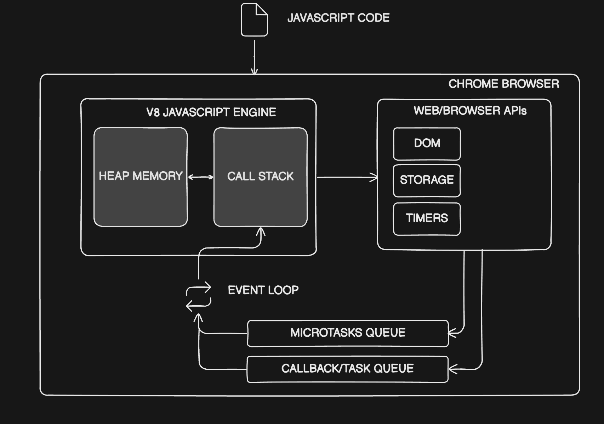
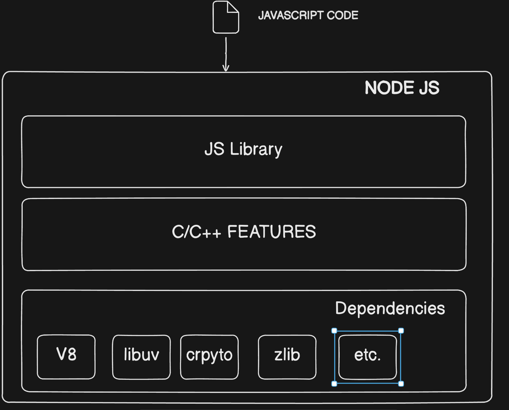

## Javascript Runtime

- Javascript runtime is an environment which provides all the necessary components in order to use and run Javascript program.
- Every browser has a Javascript engine.
- A Javascript engine is one component in the Javascript runtime.
- What else does Javascript Runtime consists of?

## Chrome browser Javascript runtime

## NodeJs runtime

## Ways of executing Javascript code in NodeJs

1. REPL(READ, EVALUATE, PRINT, LOOP): Type `node` and press enter in the terminal.
2. Creating a Javascript file, adding the content to it and executing it using `node <filename.js>` command.
